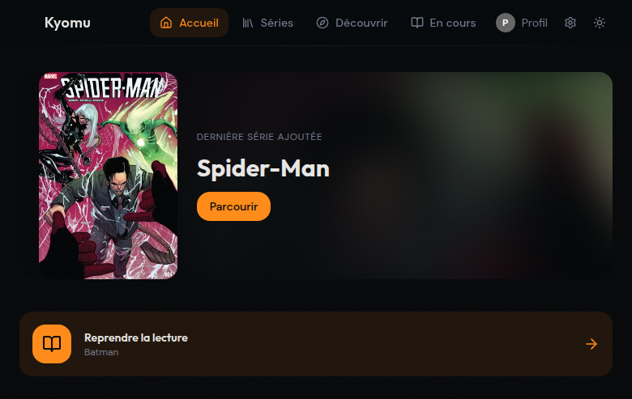
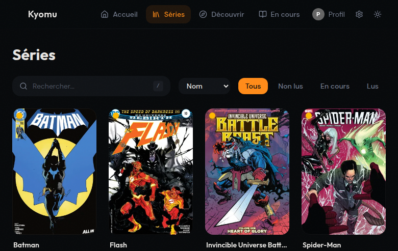
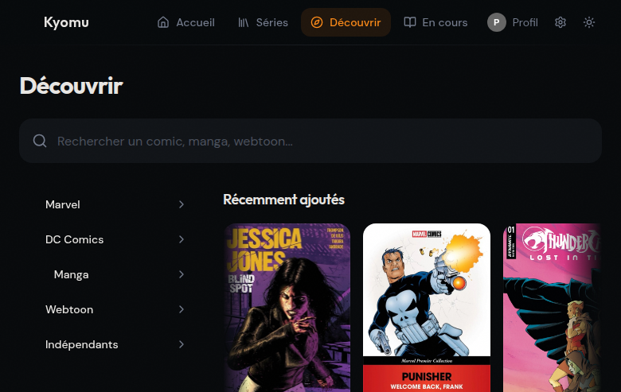
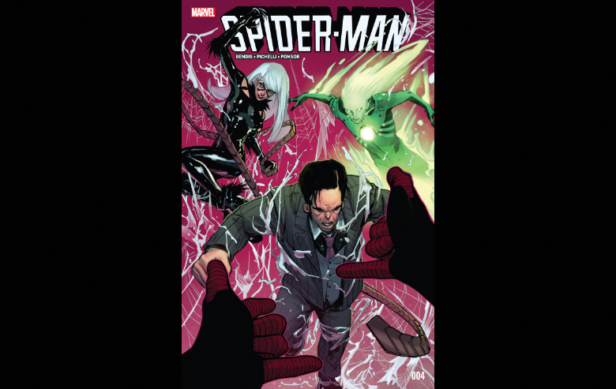

<div align="center">

# 虚 Kyomu

**A lightweight, modern, self-hosted comic reader**

*Alternative to Komga — built with Next.js, designed for speed*



</div>

---

## Features

| | Feature | Description |
|---|---------|-------------|
| 📚 | **Library** | Auto-scan your collection (CBZ, CBR, PDF, image folders) |
| 📖 | **Reader** | Page-by-page, vertical scroll (webtoon), double-page spread |
| 🎯 | **Touch-first** | Swipe, pinch-to-zoom, double-tap — installable as PWA |
| 🔍 | **Discover** | Browse ComicVine catalog with categories (Marvel, DC, Manga, Webtoon) |
| ⬇️ | **Download** | Request comics via Kapowarr and/or Mylar3 integration |
| 📊 | **Progress** | Reading progress tracking, resume, inter-volume navigation |
| 👤 | **Profiles** | Multi-user profiles with optional PIN protection |
| 🏷️ | **Tags** | Organize series with custom tags |
| 🌓 | **Themes** | Light/dark mode + customizable accent color |
| 📡 | **OPDS** | Compatible with external readers (Panels, Chunky) |
| 🔌 | **REST API** | Full API for integration with other services |

<details>
<summary>📸 More screenshots</summary>

### Series Library


### Discover (Seerr-like)


### Comic Reader


</details>

## Quick Start

### Docker Compose

```yaml
services:
  kyomu:
    build: https://github.com/EvanPluchart/kyomu.git
    ports:
      - "3000:3000"
    volumes:
      - kyomu-data:/app/data
      - /path/to/comics:/comics:ro
    environment:
      - COMICS_PATH=/comics
    restart: unless-stopped

volumes:
  kyomu-data:
```

See [`docker-compose.example.yml`](docker-compose.example.yml) for all options.

### Environment Variables

| Variable | Description | Default |
|----------|-------------|---------|
| `COMICS_PATH` | Comics directory path | `/mnt/media/comics` |
| `DATABASE_PATH` | SQLite database path | `./data/kyomu.db` |
| `SCAN_INTERVAL_MINUTES` | Auto-scan interval | `60` |
| `COMICVINE_API_KEY` | ComicVine API key (optional) | — |
| `KAPOWARR_API_KEY` | Kapowarr API key (optional) | — |
| `KAPOWARR_INTERNAL_URL` | Kapowarr internal URL | `http://localhost:5656` |
| `MYLAR3_API_KEY` | Mylar3 API key (optional) | — |
| `MYLAR3_INTERNAL_URL` | Mylar3 internal URL | `http://localhost:8090` |

### Supported Formats

- **CBZ** — native streaming (yauzl)
- **CBR** — via `unrar-free`
- **PDF** — via `poppler-utils` (pdftoppm)
- **Image folders** — jpg, png, webp

## Tech Stack

- [Next.js 16](https://nextjs.org/) — App Router, Server Components
- [Tailwind CSS 4](https://tailwindcss.com/) + [shadcn/ui](https://ui.shadcn.com/)
- [Drizzle ORM](https://orm.drizzle.team/) + SQLite
- [Vitest](https://vitest.dev/) — Unit tests

## Development

```bash
pnpm install
pnpm db:migrate
pnpm dev
```

## License

[MIT](LICENSE) — Evan Pluchart
